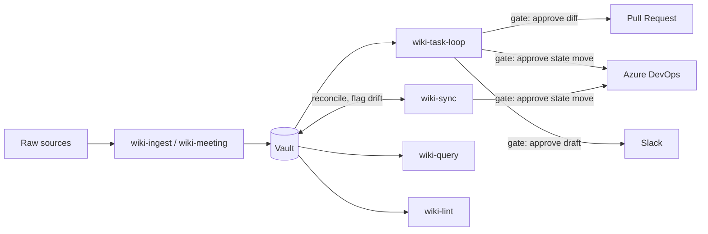

# Wiki-OMP Specification

## Purpose

This system is a personal LLM wiki. It follows the pattern in `llm-wiki.md`.
The agent reads raw sources and meetings, then builds a typed Obsidian
vault. The vault holds the current state: orgs, projects, tasks, people,
decisions, notes, and sources. OMP skills operate the vault and connect
it to Azure DevOps (ADO) and Slack for Viko's work at ClearRoute on the
NESO AI Platform.

## Decision record

| # | Decision | Locked choice |
|---|----------|----------------|
| 1 | Vault location | `/Users/viko/personal/wiki`. Obsidian registers it as `vault://wiki/`. |
| 2 | Structure | A pure type-first database vault. Each top folder is a table. Each file is a row. Frontmatter holds the columns. |
| 3 | Structured views | Obsidian Bases (`.base` files) only. The vault does not use Dataview. |
| 4 | Task source of truth | The vault. The agent pushes task state to ADO. A sync workflow flags drift and never overwrites the vault silently. |
| 5 | Autonomy | The agent runs the dev loop on its own. It asks before it creates a pull request or moves an ADO item to review or done. |
| 6 | Slack | The agent reads Slack freely. It never posts without an approved draft. |
| 7 | Packaging | One OMP skill per workflow, in `~/.omp/agent/skills/`. A `# Wiki` section in `~/.omp/agent/APPEND_SYSTEM.md`. Sticky invariants in `~/.omp/agent/RULES.md`. |
| 8 | Meeting capture | Two entry points: the user drops a file in `vault/raw/`, or pastes text in chat. Both feed the same ingest pipeline. |
| 9 | Session scope | The main agent may write to the vault directly when the user asks for a write. It delegates only large or multi-page writes to a `task` subagent. |

## Architecture

The system has three layers.

- **Raw sources** (`vault/raw/`): immutable originals. Transcripts and
  clippings land here first. The agent reads these files but never edits
  them.
- **The wiki** (typed pages under `vault/`): orgs, projects, tasks,
  meetings, people, decisions, notes, and sources. The agent owns this
  layer. It creates pages, updates cross-references, and keeps the index
  and log current.
- **The schema** (`vault/schema.md` and the OMP skills): the contract
  that defines page types, fields, naming rules, and workflows. Schema
  changes flow down to templates, views, and skills.



## Vault structure

```
vault/
  schema.md      # the contract: conventions, page types, fields, log format
  index.md       # catalog of hub pages, grouped by type
  log.md         # append-only event log
  orgs/          # one page per org: NESO, ClearRoute, Personal
  projects/      # one page per project or repo
  tasks/         # one page per task
  meetings/      # one page per meeting, named YYYY-MM-DD-<slug>.md
  people/        # one page per person, named first-last.md
  decisions/     # one page per decision, named YYYY-MM-DD-<slug>.md
  notes/         # concept pages, syntheses, and filed answers
  sources/       # one page per ingested source, named YYYY-MM-DD-<slug>.md
  raw/           # immutable originals; the agent never edits these files
  views/         # .base files for structured queries
  templates/     # one template per page type
```

Naming uses kebab-case everywhere. Meeting, decision, and source files
carry a `YYYY-MM-DD-` prefix. Person files use `first-last.md`.

## Page types

Full field definitions live in `vault://wiki/schema.md`. This table
lists only the key fields per type.

| Type | Folder | Key fields | View file |
|------|--------|------------|-----------|
| org | `orgs/` | `ado_org`, `slack_channels`, `status` | none |
| project | `projects/` | `org`, `repo`, `ado_project`, `ado_repo`, `default_branch`, `ado_states`, `status` | `projects.base` |
| task | `tasks/` | `project`, `status`, `priority`, `started`, `ado_id`, `ado_state` | `tasks.base` |
| meeting | `meetings/` | `date`, `kind`, `project`, `attendees` | `meetings.base` |
| person | `people/` | `org`, `role`, `slack_id` | `people.base` |
| decision | `decisions/` | `project`, `status`, `supersedes` | `decisions.base` |
| note | `notes/` | `projects`, `topics`, `updated` | none |
| source | `sources/` | `origin`, `url`, `raw`, `projects` | `sources.base` |

Org and note pages have no dedicated `.base` file. Query them through
`index.md` or `?op=search`.

## Workflows

| Skill | Trigger | Gates | Writes |
|-------|---------|-------|--------|
| `wiki-ingest` | A new source arrives, as a file or pasted text. | none | `raw/`, `sources/`, linked pages, `index.md`, `log.md` |
| `wiki-meeting` | The user gives a meeting transcript or note to file. | none | `meetings/`, `tasks/` (status inbox), `people/`, `projects/`, `log.md` |
| `wiki-task-loop` | The user picks a task, or names one, to work. | Diff, pull request, and ADO review move (one gate). Slack draft approval. | `tasks/` (branch, started), `projects/` (`ado_states` bootstrap), repo files, ADO, pull request, Slack draft, `log.md` |
| `wiki-sync` | On a schedule, or on demand, to check vault and ADO alignment. | triage promotions; task close; drift stays flagged | `projects/` (`ado_states`), `tasks/` (new pulled pages, `## Drift`), ADO, `log.md` |
| `wiki-lint` | On a schedule, or on demand, to health-check the vault. | none | `notes/` (lint report), `log.md` |
| `wiki-query` | The user asks a question about the wiki. | none | `notes/` (durable answers only), `index.md`, `log.md` |
| `wiki-comms` | The agent needs to read or draft a Slack message. | Slack post. | `people/` (`slack_id`), `sources/` (filed threads), `log.md` |
| `wiki-spec` | The agent, or the user, changes wiki workflows, schema, or vault structure. | none | this file |

## Autonomy and gates

- The agent runs pick-task, implement, debug, and test on its own.
- The agent asks before it creates a pull request.
- The agent asks before it moves an ADO item to a review or done state.
- The agent asks before it posts any message to Slack.
- The agent asks the user before it promotes a task from inbox to
  todo.
- The agent asks the user before it closes a task as done.
- The vault stays the task source of truth. ADO drift never overwrites
  the vault silently; the sync workflow flags it instead.

## Tool map

**Vault** (read, write, edit, grep on `vault://wiki/<path>`):
- File ops: `?op=outline|backlinks|links|tags|properties|tasks|base`
- Vault ops: `?op=search&q=...`, `?op=orphans`, `?op=unresolved`,
  `?op=bases`, `?op=daily`

**ADO read:** `xd://mcp__azure_devops_wit_work_item`, `wit_query`,
`wit_backlog`, `work`, `search_workitem`, `repo_pull_request`

**ADO write:** `xd://mcp__azure_devops_wit_work_item_write`,
`wit_work_item_comment_write`, `repo_create_branch`,
`repo_pull_request_write`

**Slack read:** `xd://mcp__slack_channels_me`, `channels_list`,
`conversations_history`, `conversations_replies`,
`conversations_search_messages`, `conversations_unreads`, `users_search`

**Slack write (gated by approval):**
`xd://mcp__slack_conversations_add_message`

## Setup

1. Re-open `/Users/viko/personal/wiki` as a Vault in Obsidian. It then
   resolves as `vault://wiki/`.
2. Configure the Azure DevOps and Slack MCP servers, in the user-level
   `mcp.json`.
3. Verify the setup:
   - Read `/Users/viko/personal/wiki/schema.md` as a plain file. This
     checks filesystem access. It needs no Obsidian registration.
   - Read `vault://wiki/schema.md`. This checks the `vault://` route.
     It needs Obsidian to register the vault first.
   - Read `skill://wiki-ingest`. This checks skill discovery.
   - Read one item from each MCP server, for example
     `xd://mcp__azure_devops_wit_backlog` and
     `xd://mcp__slack_channels_me`. This checks that both servers
     respond.
4. Run `wiki-sync` once. This seeds tasks from the ADO board.
5. Clone the known project repos. Set `repo_path` on each project
   page. wiki-task-loop asks for any missing value once, then saves
   it.

The skills live in `~/.omp/agent/skills/`, a symlink into the
git-tracked dotfiles repo. The system prompt carries the wiki summary
in the `# Wiki` section of `~/.omp/agent/APPEND_SYSTEM.md`. Sticky
invariants live in `~/.omp/agent/RULES.md`. None of these need a
per-project `.omp/` folder.

## Maintenance

Run `wiki-lint` once a week. Fix orphans, unresolved links, and schema
drift that it finds.

Schema changes start in `vault/schema.md`. Update templates next, then
views, then skills. Never let a skill or template drift from the schema.
